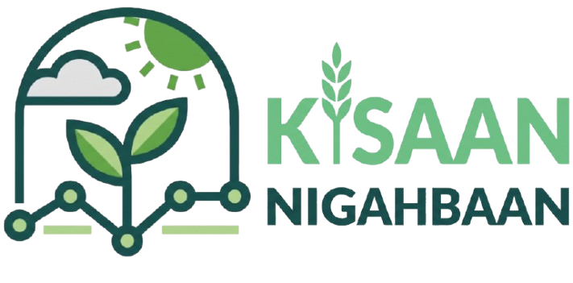
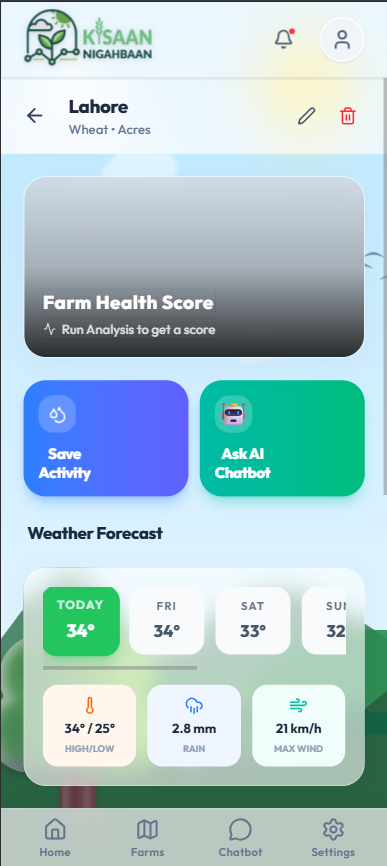
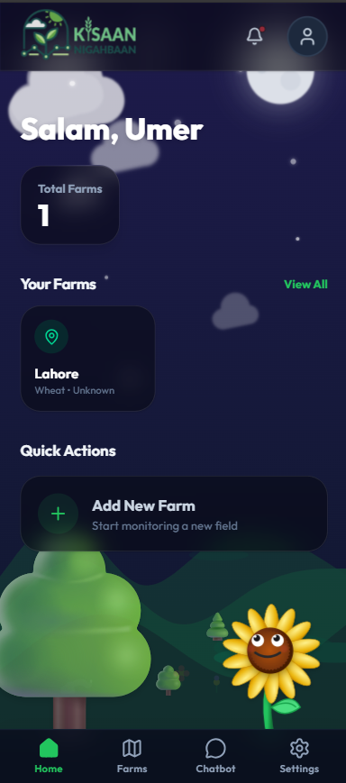

<div align="center">
  <a href="https://github.com/khawajabilalahmad/Kisan-Nighaban">
    
  </a>

  <h1 align="center">Kisaan Nighabaan (کسان نگہبان)</h1>

  <p align="center">
    <strong>AI-Powered Climate Risk Assessment & Farm Companion for Pakistan</strong>
    <br />
    <br />
    <a href="#features">Features</a>
    ·
    <a href="#tech-stack">Tech Stack</a>
    ·
    <a href="#getting-started">Getting Started</a>
  </p>

  <p align="center">
    
    
    
    
  </p>
</div>

---

## 🌾 About The Project

**Kisaan Nighabaan** is a comprehensive, AI-driven farm management application designed specifically to help farmers navigate the complexities of climate change. By integrating real-time weather data with deeply localized crop profiles, the app generates automated climate risk assessments (Heat, Flooding, Drought, Wind) and offers actionable, context-aware recommendations.

The app features a built-in **Digital Kisaan Bhai**—an intelligent, conversational AI mascot powered by Google Gemini that speaks to farmers in their native language (Urdu, Roman Urdu, or English), providing localized advice, crop monitoring, and daily farming tips.

### 🌟 Key Features

- **🤖 Digital Kisaan Bhai (AI Companion):** A fully contextual chatbot that understands your specific farm, recent activities, and local weather.
- **🌍 Trilingual Support:** Seamlessly switch between English, Urdu (اردو), and Roman Urdu (Hinglish) across the entire app.
- **🌦️ Climate Risk Engine:** Automatically cross-references 7-day weather forecasts with crop-specific tolerances to warn against heat stress, flooding, or drought.
- **📱 PWA Mobile Ready:** Designed as a Progressive Web App (PWA) with a bottom-navigation mobile-first interface. Installable directly to the home screen.
- **📍 Interactive Farm Mapping:** Pinpoint farm locations using GPS or interactive map selection.
- **📸 Vision AI:** Upload pictures of your crops directly to the chat to get disease identification and instant advice.

---

## 🛠 Tech Stack

### Frontend

- **React 18** (Vite)
- **Tailwind CSS** (for fully responsive, modern UI)
- **i18next** (Internationalization for EN/UR/RU)
- **Vite PWA Plugin** (Service workers, offline support)
- **React Router Dom** (Navigation)
- **React Markdown** (Rendering AI responses)

### Backend

- **FastAPI** (High-performance Python API)
- **SQLAlchemy & SQLite** (Asynchronous database management)
- **Google GenAI SDK** (Gemini 3.1 Flash Lite integration)
- **Open-Meteo API** (Free, open-source weather forecasting)

---

## 🚀 Getting Started

To get a local copy up and running, follow these simple steps.

### Prerequisites

- [Node.js](https://nodejs.org/) (v18 or higher)
- [Python](https://www.python.org/) (v3.10 or higher)
- A [Google Gemini API Key](https://aistudio.google.com/)

### Installation

1. **Clone the repository**

   ```bash
   git clone https://github.com/khawajabilalahmad/Kisan-Nighaban.git
   cd Kisan-Nighaban
   ```

2. **Setup the Backend (FastAPI)**

   ```bash
   cd backend
   python -m venv .venv

   # Activate virtual environment
   # Windows:
   .venv\Scripts\activate
   # macOS/Linux:
   source .venv/bin/activate

   # Install dependencies
   pip install -r requirements.txt
   ```

3. **Configure Environment Variables**
   Create a `.env` file in the `backend/` directory:

   ```env
   DATABASE_URL=sqlite+aiosqlite:///./kisan_nighaban.db
   SECRET_KEY=your_super_secret_jwt_key
   GEMINI_API_KEY=your_google_gemini_api_key
   ```

4. **Initialize the Database**

   ```bash
   python init_db.py
   python seed.py # Optional: seeds dummy data
   ```

5. **Run the Backend Server**

   ```bash
   uvicorn app.main:app --reload --port 8000
   ```

6. **Setup the Frontend (React)**
   Open a new terminal and navigate to the frontend folder:

   ```bash
   cd frontend
   npm install
   ```

7. **Run the Frontend Server**
   ```bash
   npm run dev
   ```

You can now access the app at `http://localhost:5173`.

---

## 📸 Screenshots

<div align="center">
  
  
</div>

---

<div align="center">
  Built with ❤️ for the farmers of Pakistan.
</div>
